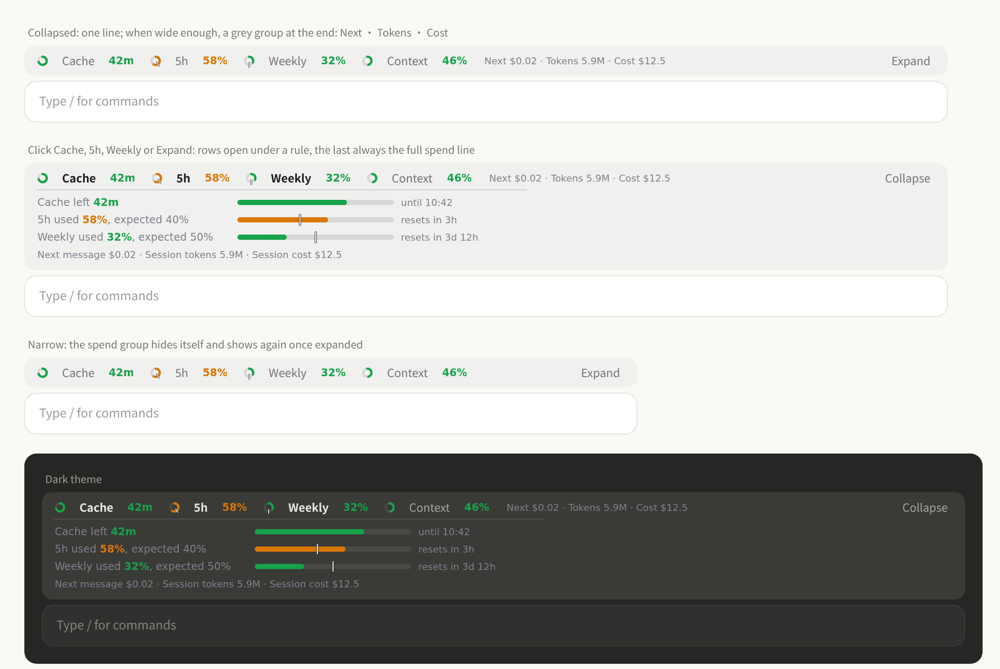
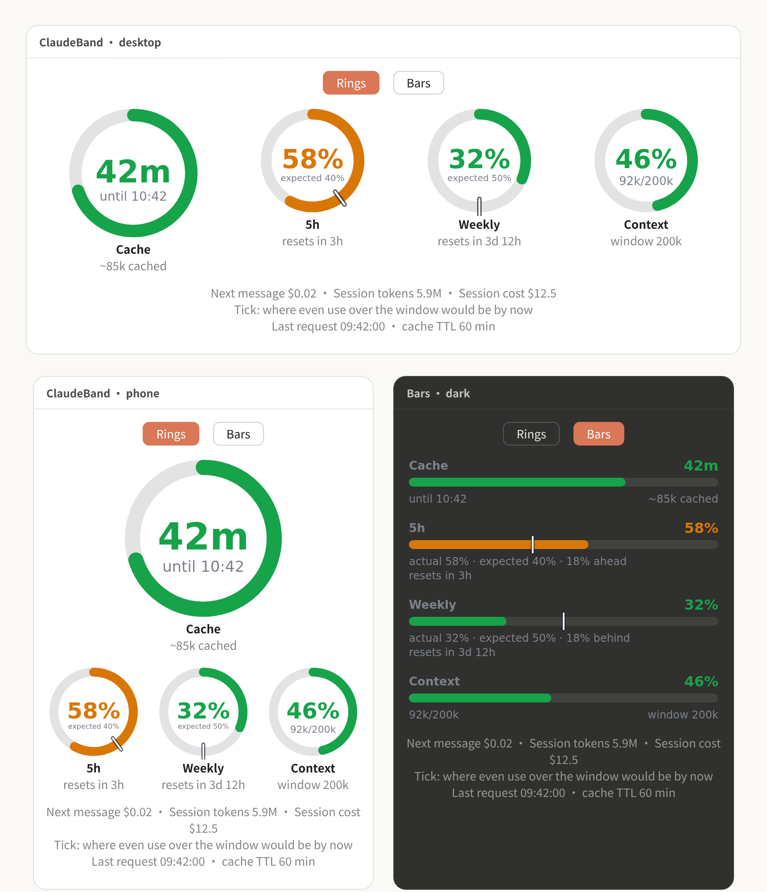
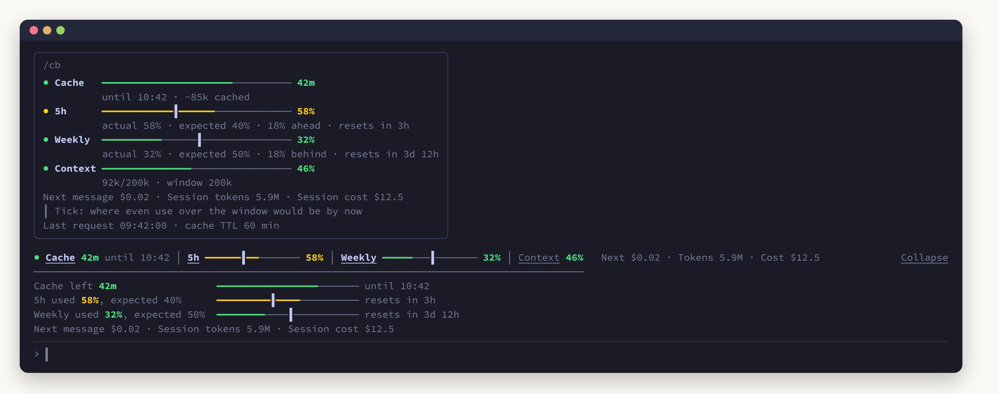

<div align="center">


# ClaudeBand

**A cache clock for Claude Code: prompt-cache countdown, 5-hour and weekly limits, context and spend, in one line above the prompt.**

[简体中文](README.md) · **English**


<sub>An unofficial community plugin, not affiliated with Anthropic. See the <a href="#disclaimer">disclaimer</a>.</sub>



</div>

---

## Why

Claude Code's prompt cache expires. While it is warm, the conversation so far is billed at the cache-read rate; once it goes cold, the next message writes the whole context to the cache again, which can cost tens of times more. Subscribers are also held to a **5-hour window** and a **weekly (7-day) window**.

ClaudeBand keeps those numbers in view and tells you **how long the cache has left, whether your pace will run a limit out early, and roughly what the next message costs**.

## Features

| | |
|---|---|
| ⏱ **Cache countdown** | Time until the cache goes cold; seconds in the last 5 minutes; once cold, how many tokens the next message re-caches |
| 🕔 **5h / Weekly** | Percent used + a **pace tick** (where even use over the window would be by now); the colour changes when you run ahead |
| 🧠 **Context** | Share and token count of the context window |
| 💲 **Spend** | Next message · Session tokens · Session cost, small and grey, apart from the gauges |
| 🖱 **Click to open** | Cache, 5h, Weekly and Context in the band are buttons that open a bar under a rule; Expand / Collapse on the right opens or closes them all |
| 🍩 **Rings / Bars** | The pane switches between rings and bars; bars spell out "actual · expected · ahead/behind" |
| 🌐 **Languages** | 中文 and English, switched with `/cb lang`; [new languages welcome](docs/TRANSLATING.md) |
| 📱 **Every surface** | Coloured character bars on the terminal, SVG on desktop / phone / VS Code, legible in light and dark |

## Install

### Let Claude install it

Paste this into Claude Code; it works out the rest:

```text
Install the Claude Code plugin ClaudeBand: https://github.com/ButterFuture/ClaudeBand
- Pick the interface language from my environment and write it to its config, pluginConfigs["claude-band"].options.language: one of auto, zh, en.
- It is a function hooks plugin; if it does not load, add CLAUDE_CODE_ENABLE_FUNCTION_HOOKS=1 to env.
- When done, remind me to run /reload-plugins, then type /cb.
```

<details>
<summary><b>Manual install</b></summary>

> [!IMPORTANT]
> This is a **function hooks** plugin (an early-access Claude Code feature). If loading says `hooks modules are not turned on`, set `CLAUDE_CODE_ENABLE_FUNCTION_HOOKS=1`.

**1. Clone it**

```bash
git clone https://github.com/ButterFuture/ClaudeBand.git ~/.claude/plugins-local/ClaudeBand
```

**2. Have Claude Code load it**, either:

- to keep it: in `~/.claude/settings.json`, under `env`

  ```json
  {
    "env": {
      "CLAUDE_CODE_PLUGIN_DIRS": "/home/<you>/.claude/plugins-local/ClaudeBand"
    }
  }
  ```

- to try it once:

  ```bash
  claude --plugin-dir ~/.claude/plugins-local/ClaudeBand
  ```

**3. Reload**: start a new session, or run `/reload-plugins` in one.

</details>

## Use

| Do | Get |
|---|---|
| Send a message | The cache clock starts |
| Click Cache, 5h, Weekly or Context in the band | That gauge opens / closes under the rule; several can be open |
| Click Expand / Collapse on the right | All four open, or all close |
| `/cb` (or `/claude-band`) | Opens the pane on a computer; on the phone, which has no pane, answers with the numbers as plain text |
| `/cb text` | The numbers as plain text, anywhere |
| `/cb lang` | Shows the language and the choices |
| `/cb lang en` / `/cb lang zh` / `/cb lang auto` | Switches language, stored in settings for later sessions too |
| Rings / Bars at the top of the pane | Switches the view |

## Reading it

**The tick is the pace**: it marks where you would be by now had you used the window evenly from its start. Colour left of the tick means you are slower than pace; past it, faster.

Every bar but the cache's **fills from zero with what is used**; the cache's shows **time left** and drains. Green → amber → red asks for more attention; grey means expired or no reading.

<details>
<summary><b>Colour rules</b></summary>

| Colour | Cache | 5h / Weekly | Context |
|---|---|---|---|
| 🟢 Green | more than 10 min left | under 80% used, and under 10 points ahead of the pace tick | < 80% |
| 🟡 Amber | 5–10 min left | 80% used or more, or 10 points or more ahead of the tick | 80–90% |
| 🔴 Red | under 5 min (counting seconds) | 90% used or more | ≥ 90% |
| ⚪ Grey | expired / not started | no reading | no reading |

80, 90 and 10 are defaults you can change in `/config` (see Settings below). "Ahead" counts points, not a ratio: 10% used early in the week with the tick at 4% is 6 points ahead, and stays green.

</details>

<details>
<summary><b>The spend line, and how "Next message" is worked out</b></summary>

| Name | On the collapsed line | Meaning |
|---|---|---|
| Next message | Next | What sending the next message costs **for the context it carries** |
| Session tokens | Tokens | Tokens of every turn this session (input, output, cache reads and writes; subagents included) |
| Session cost | Cost | What the session has cost, the same figure as `/cost` |

**Next message** = `context tokens × rate ÷ 1,000,000`

- Cache warm (under 60 minutes since the last request): the context is read from the cache, at the **cache-read rate**
- Cache cold: the context is written to the cache again, at the **1-hour cache-write rate (2 × input)**
- The rate is that of the model the main conversation last ran on, from the list prices built into the plugin

> Example: Opus 5.5, 410k context. Warm: `410k × $0.20 ÷ 1M ≈ $0.08`; cold: `410k × $8 ÷ 1M ≈ $3.28`, forty times as much.

It prices the prompt only: the reply's output is **not** included, nor the small new part (your message and the last reply) written to the cache, so the real cost runs a little higher.

</details>

## On each surface

**The pane (`/cb`)**: rings or bars on desktop / phone / VS Code; it opens by itself when a phone attaches.

<p align="center"></p>

**Terminal**: no SVG there, so coloured character bars say the same, `┃` being the pace tick.

<p align="center"></p>

<details>
<summary><b>Layout details per surface</b></summary>

**The band above the prompt (terminal, desktop)**

- **Collapsed**: one line of four gauges. When wide enough, a small grey group follows: Next · Tokens · Cost; when not, it hides
- **Opened**: click a label to open that gauge, or Expand on the right for all; a bar per gauge under a rule, and the last row **always** the full "Next message · Session tokens · Session cost"
- The first line never wraps: should the width estimate be off, the spend group is cut rather than Expand pushed down
- On the terminal, the labels and Expand / Collapse take mouse clicks in the fullscreen layout

**The pane**

- **Wide**: four rings in a row, the cache's a size larger
- **Narrow (phone)**: the cache ring on its own, the other three beneath; narrower still, Context goes
- **Bars**: one row a gauge, "actual 58% · expected 40% · 18% ahead" and the reset time under it
- Which gauges are open and which view the pane shows last for the session

</details>

## Language

`auto` by default: Claude Code's `language` setting first, then `LC_ALL` / `LC_MESSAGES` / `LANG`; **Chinese** when none says. Pin one with `/cb lang zh` or `/cb lang en`.

Want another language? Copy one file, translate it, open a pull request: see the [translation guide](docs/TRANSLATING.md).

<details>
<summary><b>Settings</b>: language and warning levels</summary>

All in the `/config` menu (the ClaudeBand rows), or in `~/.claude/settings.json` under `pluginConfigs["claude-band"].options`:

| Setting | Default | Means |
|---|---|---|
| `language` | `auto` | Interface language: `auto` / `zh` / `en` |
| `warnAt` | `80` | 5h, weekly and context turn yellow at this percent used |
| `alertAt` | `90` | …and red at this one |
| `paceMargin` | `10` | A 5h or weekly window turns yellow early this many points ahead of the pace tick; `0` turns it off |

```json
{ "pluginConfigs": { "claude-band": { "options": { "warnAt": 75, "alertAt": 90, "paceMargin": 15 } } } }
```

</details>

<details>
<summary><b>Other ways to set the language</b></summary>

Besides `/cb lang <code>`, change **Language / 语言** in the `/config` menu, or write it in `~/.claude/settings.json`; all three do the same:

```json
{ "pluginConfigs": { "claude-band": { "options": { "language": "en" } } } }
```

</details>

<details>
<summary><b>Where the numbers come from, and caveats</b></summary>

| Number | Source |
|---|---|
| Cache | Kept by the plugin: the clock restarts with each main-conversation request (subagents' do not count). The lifetime is taken as **60 minutes** |
| 5h / Weekly | `$.session.usage().rateLimits`: the reading the last API response carried; **subscription accounts only** |
| Context | `$.session.usage().context`, as the status line has it |
| Session tokens | Added up at each `turn.complete`, subagents included |
| Session cost | `$.session.usage().cost`, as `/cost` has it |
| Next message | Context × rate, the rate from the `PRICES` table in `hooks/register.tsx` |

- The cache lifetime is **assumed** to be 60 minutes, not read from the API. If yours is the 5-minute tier, the countdown and the next-message price run optimistic; change `DEFAULT_TTL_MS` in `hooks/register.tsx`.
- Limits are as of the last reply, not live; past a window's reset it shows "reset".
- **Session tokens** count only from when the plugin loaded (the plugin cannot read earlier messages' tokens) and start at 0 in a new or resumed session; **Session cost** is Claude Code's own ledger, so the two can disagree.
- Prices are list prices; with custom organisation pricing, or a model not in the table, the next-message price is off or shows "—".

</details>

<details>
<summary><b>Development</b></summary>

```text
ClaudeBand/
├── .claude-plugin/plugin.json   manifest (with the language option)
├── hooks/
│   ├── hooks.json               points at register.tsx
│   ├── register.tsx             the logic: gauges, prices, terminal text, SVG, interaction, commands
│   └── locales/                 the words: one file per language
│       ├── types.ts             the fields every language fills (documented)
│       ├── zh.ts · en.ts        Chinese, English
│       └── index.ts             the list of languages and auto-detection
├── types/index.d.ts             the $.state contract (last / bandOpen / paneView / spent)
├── tests/render.test.ts         rendering on every surface, clicks, spend, languages, commands
└── docs/                        logo, screenshots per language, translation guide
```

```bash
# type-check (needs .claude-plugin/types/ from Claude Code: run /plugin-types in a session)
npx -p typescript@5 tsc -p .

# check the manifest, hooks and state contract
claude plugin validate .

# run the tests: four surfaces, buttons, spend, languages and commands
CLAUDE_CODE_ENABLE_FUNCTION_HOOKS=1 claude plugin test .
```

Run `/reload-plugins` in a session after a change.

</details>

<details>
<summary><b>Known limits</b></summary>

- Only buttons take clicks: an SVG ring cannot, so interaction lives on the labels and buttons.
- On the terminal, clicks work in the fullscreen layout only; the labels have no digit hotkeys, so typing a number into an empty prompt cannot press one.
- The desktop tells the plugin the band's width in columns, not pixels. The plugin converts at a measured ~9.4 px a column to decide whether the spend group fits; with the app zoomed or a different font size, that call can be off either way.
- Buttons and the band's frame are drawn by each Claude Code surface; their look in the screenshots is an approximation. Screenshots are rendered from the plugin's real output (test data).

</details>

## License

[GNU Affero General Public License v3.0](LICENSE) (AGPL-3.0).

## Disclaimer

ClaudeBand is an **unofficial** community plugin. It is not affiliated with, endorsed by, sponsored by or reviewed by Anthropic PBC. "Claude" and "Claude Code" are trademarks of Anthropic, used here only to say which product the plugin works with.

The limits, spend and cache times it shows are **estimates** from public interfaces and published prices and may differ from what you are actually billed; Anthropic's own billing and usage pages are authoritative. The project is provided "as is", without warranty, and its authors accept no liability for any cost or loss arising from its use.

Questions and suggestions: open an [issue](https://github.com/ButterFuture/ClaudeBand/issues) on GitHub, or write to [ButterFuture@proton.me](mailto:ButterFuture@proton.me).
