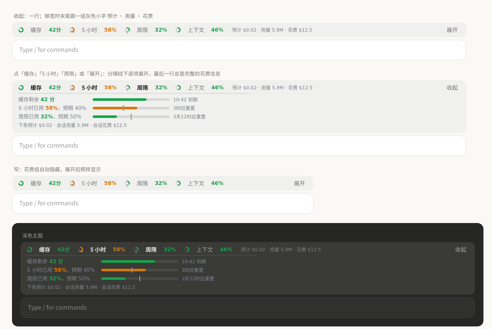
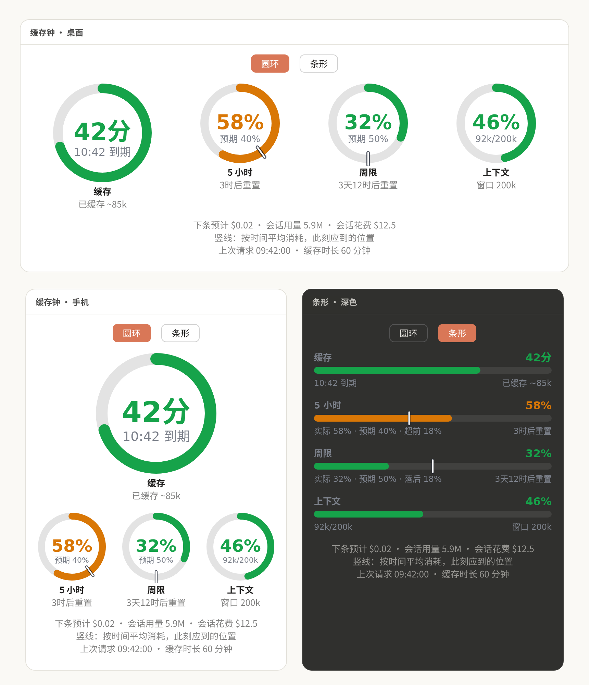
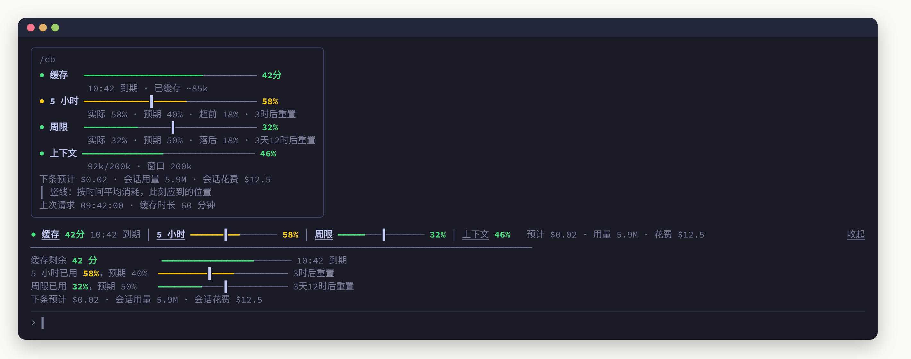

<div align="center">


# ClaudeBand

**缓存钟：把 Claude Code 的提示缓存倒计时、5 小时额度、周限额度、上下文和花费，放进输入框上方的一行里。**

**简体中文** · [English](README.en.md)


<sub>社区制作的非官方插件，与 Anthropic 无关，详见文末<a href="#免责声明">免责声明</a>。</sub>



</div>

---

## 为什么要它

Claude Code 的提示缓存有有效期。缓存还热时继续对话，前面的上下文按读缓存价计费；一旦过期，下一条消息要把整段上下文重新写入缓存，价格可能差几十倍。同时，订阅用户还受 **5 小时窗口** 和 **周限（7 天窗口）** 两道额度约束。

ClaudeBand 把这些数字一直摆在眼前，告诉你**缓存还剩多久、照现在的速度额度会不会提前用完、下一条消息大概多少钱**。

## 功能一览

| | |
|---|---|
| ⏱ **缓存倒计时** | 距离缓存过期还剩多久；最后 5 分钟按秒跳动，过期后提示下条消息要重写多少 token |
| 🕔 **5 小时 / 周限** | 已用百分比 + **预期竖线**（按时间平均消耗，此刻应该用到哪里），用得比预期快就变色 |
| 🧠 **上下文** | 上下文窗口已用比例和 token 数 |
| 💲 **花费** | 下条预计 · 会话用量 · 会话花费，灰色小字，和上面几项分开 |
| 🖱 **可点击展开** | band 上的「缓存」「5 小时」「周限」「上下文」都是按钮，点开在分隔线下显示进度条；右侧「展开 / 收起」一键全开全关 |
| 🍩 **圆环 / 条形** | 面板里切换圆环视图和条形视图，条形视图写明「实际 · 预期 · 超前/落后」 |
| 🌐 **多语言** | 中文、English；`/cb lang` 一条命令切换，[欢迎贡献新语言](docs/TRANSLATING.md) |
| 📱 **全端适配** | 终端用彩色字符进度条，桌面 / 手机 / VS Code 用 SVG，浅色深色主题都看得清 |

## 安装

### 自动安装

把下面这段话发给 Claude Code，剩下的它会自己完成：

```text
帮我安装 Claude Code 插件 ClaudeBand：https://github.com/ButterFuture/ClaudeBand
- 按我的环境选界面语言，写进它的配置 pluginConfigs["claude-band"].options.language，只能是 auto、zh、en 之一。
- 它是 function hooks 插件，加载不了就在 env 里加 CLAUDE_CODE_ENABLE_FUNCTION_HOOKS=1。
- 装好后提醒我执行 /reload-plugins，再输入 /cb。
```

<details>
<summary><b>手动安装</b></summary>

> [!IMPORTANT]
> 这是一个 **function hooks** 插件（Claude Code 的早期功能）。如果加载时提示 `hooks modules are not turned on`，需要设置环境变量 `CLAUDE_CODE_ENABLE_FUNCTION_HOOKS=1`。

**1. 克隆到本地**

```bash
git clone https://github.com/ButterFuture/ClaudeBand.git ~/.claude/plugins-local/ClaudeBand
```

**2. 让 Claude Code 加载它**，二选一：

- 长期使用：在 `~/.claude/settings.json` 的 `env` 里加上

  ```json
  {
    "env": {
      "CLAUDE_CODE_PLUGIN_DIRS": "/home/<你>/.claude/plugins-local/ClaudeBand"
    }
  }
  ```

- 临时试用：

  ```bash
  claude --plugin-dir ~/.claude/plugins-local/ClaudeBand
  ```

**3. 重新加载**：新开会话，或在会话里执行 `/reload-plugins`。

</details>

## 使用

| 操作 | 效果 |
|---|---|
| 发一条消息 | 缓存开始计时 |
| 点 band 上的「缓存」「5 小时」「周限」「上下文」 | 在分隔线下展开 / 收起这一项，可同时展开多项 |
| 点 band 右侧「展开 / 收起」 | 一键展开全部四项，或收起全部 |
| `/cb`（或 `/claude-band`） | 电脑上打开面板；手机上回一段纯文字的当前数据（手机打不开面板） |
| `/cb text` | 任何一端都回纯文字的当前数据 |
| `/cb lang` | 查看当前语言和可选语言 |
| `/cb lang en` / `/cb lang zh` / `/cb lang auto` | 切换语言，写进设置，之后的会话也生效 |
| 面板顶部「圆环 / 条形」 | 切换视图 |

## 怎么读

**竖线 = 预期**：额度窗口里的竖线，表示如果从窗口开始就匀速消耗，此刻应该到达的位置。彩色进度在竖线左边，说明用得比预期慢；越过竖线，就是用快了。

除了缓存，所有进度条都**从零开始、显示已用**；缓存显示**剩余时间**，越走越短。颜色绿 → 黄 → 红表示越来越需要注意，灰色表示过期或暂无数据。

<details>
<summary><b>颜色规则</b></summary>

| 颜色 | 缓存 | 5 小时 / 周限 | 上下文 |
|---|---|---|---|
| 🟢 绿 | 剩余 > 10 分钟 | 已用 < 80%，且比预期竖线超前不到 10 个百分点 | < 80% |
| 🟡 黄 | 剩余 5–10 分钟 | 已用 ≥ 80%，或比预期竖线超前 ≥ 10 个百分点 | 80–90% |
| 🔴 红 | 剩余 < 5 分钟（按秒倒数） | 已用 ≥ 90% | ≥ 90% |
| ⚪ 灰 | 已过期 / 还没开始 | 暂无读数 | 暂无读数 |

80、90 和 10 都是默认值，可以在 `/config` 里改（见下面「设置」）。「超前」看的是差了几个百分点，不是倍数：周限刚开始、竖线在 4% 时用了 10%，只超前 6 个点，仍是绿色。

</details>

<details>
<summary><b>花费三项，以及「下条预计」怎么算</b></summary>

| 名称 | 收起行里 | 含义 |
|---|---|---|
| 下条预计 | 预计 | 现在发下一条消息，**把已有上下文送给模型**这部分大约多少钱 |
| 会话用量 | 用量 | 本会话所有轮次的 token 总数（输入、输出、读写缓存都算，含子代理） |
| 会话花费 | 花费 | 本会话累计花费，与 `/cost` 同一个数 |

**下条预计** = `上下文 token 数 × 单价 ÷ 1,000,000`

- 缓存还热（距上次请求不到 60 分钟）：整段上下文从缓存读，按**读缓存价**
- 缓存已冷：整段上下文重新写入缓存，按 **1 小时档写缓存价（输入价 × 2）**
- 单价按主对话最近一轮实际用的模型，查插件内置的官方价格表

> 例：Opus 5.5，上下文 410k。缓存热时 `410k × $0.20 ÷ 1M ≈ $0.08`；冷了以后 `410k × $8 ÷ 1M ≈ $3.28`，差了 40 倍。

这只是提示词部分的估算：**不含**模型回复的输出费用，也不含新消息和上一轮回复新写进缓存的那一小段，所以实际花费会略高。

</details>

## 各端效果

**面板（`/cb`）**：桌面 / 手机 / VS Code 上是圆环或条形视图；手机连上会话时自动打开。

<p align="center"></p>

**终端**：没有 SVG，用彩色字符进度条表达同样的信息，`┃` 是预期竖线。

<p align="center"></p>

<details>
<summary><b>各端的排版细节</b></summary>

**输入框上方的 band（终端、桌面）**

- **收起**：一行四项。宽度够时末尾跟一组灰色小字「预计 · 用量 · 花费」，不够宽就自动隐藏
- **展开**：点任意标签展开那一项，点右侧「展开」展开全部；分隔线下逐项显示进度条，最后一行**总是**显示完整的「下条预计 · 会话用量 · 会话花费」
- 第一行从不换行：宽度估算万一偏差，只会截掉花费组，不会把「展开」挤下去
- 终端里，全屏模式下标签和「展开 / 收起」都可以用鼠标点

**面板**

- **宽**：四个圆环一行，缓存环大一号
- **窄（手机）**：缓存大环单独一行，其余三个排在下面；再窄就去掉上下文
- **条形**：每项一行，下面写「实际 58% · 预期 40% · 超前 18%」和重置时间
- 展开了哪些项、面板选了哪种视图，只在当前会话内记住

</details>

## 语言

默认 `auto`：先看 Claude Code 设置里的 `language`，再看 `LC_ALL` / `LC_MESSAGES` / `LANG`；都看不出来时用**中文**。也可以用 `/cb lang zh` 或 `/cb lang en` 固定一种。

想加一种语言？复制一个文件、翻译、提 PR 即可，见 [翻译指南](docs/TRANSLATING.md)。

<details>
<summary><b>设置</b>：语言和预警阈值</summary>

都在 `/config` 菜单里（ClaudeBand 一栏），也可以写进 `~/.claude/settings.json` 的 `pluginConfigs["claude-band"].options`：

| 设置 | 默认 | 含义 |
|---|---|---|
| `language` | `auto` | 界面语言：`auto` / `zh` / `en` |
| `warnAt` | `80` | 5 小时、周限、上下文用到这个百分比时标黄 |
| `alertAt` | `90` | 用到这个百分比时标红 |
| `paceMargin` | `10` | 5 小时或周限比预期竖线超前这么多个百分点时提前标黄；`0` 关闭 |

```json
{ "pluginConfigs": { "claude-band": { "options": { "warnAt": 75, "alertAt": 90, "paceMargin": 15 } } } }
```

</details>

<details>
<summary><b>其他改语言的方法</b></summary>

除了 `/cb lang <语言>`，还可以在 `/config` 菜单里改 **Language / 语言**，或直接写进 `~/.claude/settings.json`，效果相同：

```json
{ "pluginConfigs": { "claude-band": { "options": { "language": "en" } } } }
```

</details>

<details>
<summary><b>数据从哪来，以及需要注意的地方</b></summary>

| 数据 | 来源 |
|---|---|
| 缓存 | 插件自己记录：主对话每发出一次请求就重新计时（子代理的请求不算）。有效期按 **60 分钟** 计 |
| 5 小时 / 周限 | `$.session.usage().rateLimits`：最近一次 API 回复带回的额度读数，**只有订阅账户才有** |
| 上下文 | `$.session.usage().context`，与状态栏同源 |
| 会话用量 | 每轮结束（`turn.complete`）时累加这一轮的 token，含子代理 |
| 会话花费 | `$.session.usage().cost`，与 `/cost` 同源 |
| 下条预计 | 上下文 × 单价，单价来自 `hooks/register.tsx` 里的 `PRICES` 表 |

- 缓存有效期是插件按 60 分钟**假定**的，不是从 API 读出来的。如果你的缓存实际是 5 分钟档，倒计时和下条预计都会偏乐观；改 `hooks/register.tsx` 里的 `DEFAULT_TTL_MS` 即可。
- 额度是"上一次回复时"的读数，不是实时查询；窗口过了重置时间会显示「已重置」。
- **会话用量**只能从插件加载后开始累计（插件接口拿不到历史消息的 token 数），新开或恢复会话时从 0 开始；**会话花费**由 Claude Code 自己记账，不受影响，两者可能对不上。
- 价格表是官方标价；组织配置了自定义价格、或用的模型不在表里时，下条预计会不准或显示「—」。

</details>

<details>
<summary><b>开发</b></summary>

```text
ClaudeBand/
├── .claude-plugin/plugin.json   插件清单（含 language 配置项）
├── hooks/
│   ├── hooks.json               指向 register.tsx
│   ├── register.tsx             全部逻辑：计算、价格表、终端文本、SVG 圆环/条形、交互、命令
│   └── locales/                 界面文字：每种语言一个文件
│       ├── types.ts             所有语言都要填的字段（带说明）
│       ├── zh.ts · en.ts        中文、英文
│       └── index.ts             语言清单与自动识别
├── types/index.d.ts             $.state 契约（last / bandOpen / paneView / spent）
├── tests/render.test.ts         各端渲染、点击交互、花费计算、语言与命令测试
└── docs/                        Logo、各语言截图、翻译指南
```

```bash
# 类型检查（需要先由 Claude Code 生成 .claude-plugin/types/，可在会话里执行 /plugin-types）
npx -p typescript@5 tsc -p .

# 校验清单、hooks 和 state 契约
claude plugin validate .

# 跑测试：四个界面的渲染、按钮、花费、语言和命令
CLAUDE_CODE_ENABLE_FUNCTION_HOOKS=1 claude plugin test .
```

改完代码后在会话里执行 `/reload-plugins` 生效。

</details>

<details>
<summary><b>已知限制</b></summary>

- 只有按钮能点：SVG 圆环本身接不到点击，所以交互都落在文字标签和按钮上。
- 终端里鼠标点击只在全屏模式下可用；标签没有绑定数字快捷键，避免在空输入框里打数字时误触。
- 桌面端只告诉插件 band 有多少「列」，不给像素宽度。插件按实测的每列约 9.4 px 换算，判断花费组放不放得下；调整了 App 的缩放或字号后，这个判断可能偏宽或偏窄。
- 文字按钮和 band 外框的样式由 Claude Code 各端自己绘制，截图里的按钮外观是示意；截图由插件真实渲染结果生成（测试数据）。

</details>

## 许可证

[GNU Affero General Public License v3.0](LICENSE)（AGPL-3.0）。

## 免责声明

ClaudeBand 是社区制作的**非官方**插件，与 Anthropic PBC 没有任何隶属、合作或背书关系，也未经其审核或认可。「Claude」「Claude Code」是 Anthropic 的商标，本项目只用它们说明插件适用的产品。

插件显示的额度、花费和缓存时间都是根据公开接口和公开价格做的**估算**，可能与实际计费不一致；请以 Anthropic 官方的账单和用量页面为准。本项目按「现状」提供，不对因使用它产生的任何费用或损失承担责任。

问题与建议请在 GitHub 提 [Issue](https://github.com/ButterFuture/ClaudeBand/issues)，或发邮件至 [ButterFuture@proton.me](mailto:ButterFuture@proton.me)。
